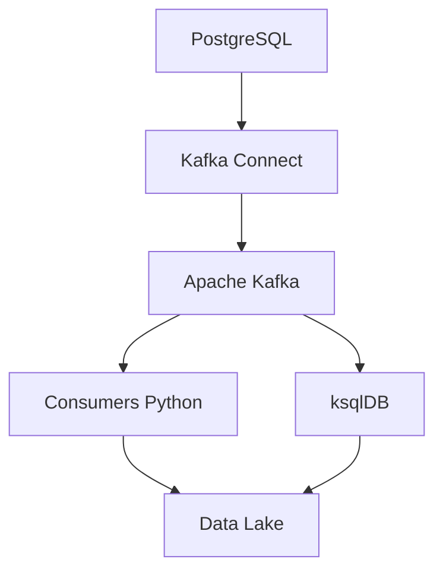

## Arquitetura



## Evidências de Execução

### Infraestrutura Docker

O ambiente foi executado localmente utilizando Docker Compose contendo:

* Apache Kafka
* PostgreSQL
* Apache Zookeeper

### Processamento de Eventos

O Producer publica eventos em um tópico Kafka.

Exemplo:

```json
{
  "evento": "CLIENTE_CADASTRADO",
  "cliente_id": 1001,
  "nome": "Cliente Exemplo",
  "status": "ativo"
}
```

O Consumer recebe e processa o evento em tempo real.

### Resultado

Validação prática do fluxo:

PostgreSQL → Kafka → Consumer → Processamento

demonstrando uma arquitetura de streaming de dados baseada em eventos.